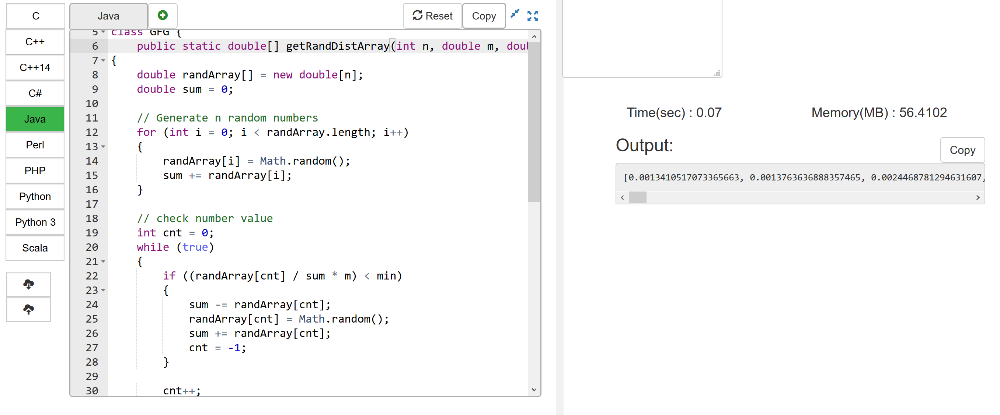

# Get random numbers with given sum, count and min value.  
---
指定数组个数, 总和以及最小值, 获取一组随机数.


```Java
/*package whatever //do not write package name here */

import java.io.*;
import java.util.Arrays;
class GFG {
    public static double[] getRandDistArray(int n, double m, double min)
{
    double randArray[] = new double[n];
    double sum = 0;

    // Generate n random numbers
    for (int i = 0; i < randArray.length; i++)
    {
        randArray[i] = Math.random();
        sum += randArray[i];
    }

    // check number value
    int cnt = 0;
    while (true)
    {
        if ((randArray[cnt] / sum * m) < min)
        {
            sum -= randArray[cnt];    
            randArray[cnt] = Math.random();
            sum += randArray[cnt];
            cnt = -1;
        }
    
        cnt++;
        if (cnt >= randArray.length)
        {
            break;
        }
        
    }
    // Normalize sum to m
    for (int i = 0; i < randArray.length; i++)
    {
        randArray[i] /= sum;
        randArray[i] *= m;
    }
    return randArray;
}
    
    public static void main (String[] args) {
        double sum[] = getRandDistArray(50, 1, 0.0001);
        Arrays.sort(sum);
        System.out.println(Arrays.toString(sum));
    }
}
```

## Put this code to :
https://ide.geeksforgeeks.org/index.php  


